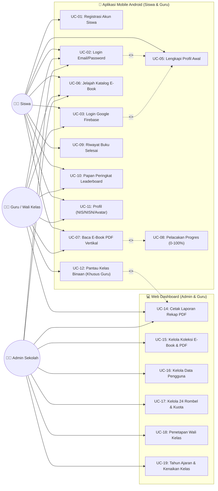

# 📘 Spesifikasi Use Case Diagram — Digilibrary SD
> **Rujukan Visual: `Picture1.png`**  
> **Cakupan Sistem: Multi-Platform (Web Admin/Guru & Mobile Android Siswa/Guru)**

Dokumen ini mendefinisikan use case, aktor, hubungan antar use case, serta skenario interaksi sistem perpustakaan digital sekolah dasar.

---

## 1. Identifikasi Aktor

| No | Aktor | Platform Utama | Deskripsi Peran |
| :-: | :--- | :--- | :--- |
| 1 | **Siswa** | Mobile Android & Web | Pengguna utama yang membaca e-book Kurikulum Merdeka, dipantau waktu bacanya secara realtime (0–100%), melihat peringkat leaderboard, dan melengkapi data profil (NIS/NISN). |
| 2 | **Guru / Wali Kelas** | Mobile Android & Web | Pendidik yang memantau capaian membaca siswa kelas binaannya, memantau leaderboard kelas, mengevaluasi siswa belum membaca, serta mencetak laporan rekapitulasi literasi kelas. |
| 3 | **Administrator** | Web Browser Desktop | Pengelola perpustakaan yang mengunggah/mengedit e-book PDF, mengelola akun (Siswa/Guru/Admin), mengelola struktur 24 rombel (1A–6C), kuota siswa, penetapan wali kelas, dan tahun ajaran. |

---

## 2. Matriks Hak Akses Use Case

| ID Use Case | Nama Use Case | Siswa (Mobile) | Guru (Mobile & Web) | Admin (Web) | Relasi / Dependensi |
| :---: | :--- | :---: | :---: | :---: | :--- |
| **UC-01** | Registrasi Akun Siswa | ✅ | ❌ | ❌ | - |
| **UC-02** | Login Akun (Email / Password) | ✅ | ✅ | ✅ | - |
| **UC-03** | Login Google One-Tap (Firebase) | ✅ | ✅ | ✅ | Optional Auth |
| **UC-04** | Pemulihan Sandi (OTP Email) | ✅ | ✅ | ✅ | - |
| **UC-05** | Lengkapi Profil Awal | ✅ | ❌ | ❌ | *<<extend>>* UC-02 / UC-03 |
| **UC-06** | Jelajah Katalog E-Book SIBI | ✅ | ✅ | ✅ | - |
| **UC-07** | Baca E-Book (PDF Scroll Vertikal) | ✅ | ✅ | ✅ | *<<include>>* UC-08 |
| **UC-08** | Pelacakan Progres Baca (0–100%) | ✅ | ✅ | ❌ | Realtime Tracking |
| **UC-09** | Lihat Riwayat Baca Selesai (100%) | ✅ | ✅ | ❌ | - |
| **UC-10** | Lihat Leaderboard Bintang Literasi | ✅ | ✅ | ✅ | - |
| **UC-11** | Kelola Profil Diri (NIS/NISN/NIP) | ✅ | ✅ | ✅ | - |
| **UC-12** | Pantau Capaian Siswa Kelas Binaan | ❌ | ✅ | ✅ | Filter per rombel |
| **UC-13** | Evaluasi Detail Baca Murid | ❌ | ✅ | ✅ | - |
| **UC-14** | Cetak Laporan Rekapitulasi PDF | ❌ | ✅ | ✅ | Format resmi A4 |
| **UC-15** | Kelola Koleksi E-Book (CRUD & Upload) | ❌ | ❌ | ✅ | - |
| **UC-16** | Kelola Pengguna (Admin/Guru/Siswa) | ❌ | ❌ | ✅ | - |
| **UC-17** | Kelola 24 Rombel & Kuota Siswa | ❌ | ❌ | ✅ | - |
| **UC-18** | Penetapan Wali Kelas Rombel | ❌ | ❌ | ✅ | - |
| **UC-19** | Kelola Tahun Ajaran & Kenaikan | ❌ | ❌ | ✅ | - |

---

## 3. Diagram Use Case Visual (Mermaid)

Salin kode berikut ke [Mermaid Live Editor](https://mermaid.live) atau render di Markdown Viewer:

---

## 4. Skenario Use Case Utama

### Skenario A: Membaca E-Book & Live Reading Tracker (UC-07 & UC-08)
1. **Aktor**: Siswa (atau Guru)
2. **Kondisi Awal**: Siswa telah login dan berada di layar Katalog Buku.
3. **Alur Utama**:
   - Siswa memilih salah satu buku dari katalog (misal: "Matematika Kelas 4").
   - Siswa menekan tombol **"Mulai Membaca"**.
   - Sistem membuka E-Reader PDF dengan render scroll vertikal dan watermark nama siswa.
   - Timer aktif berjalan setiap detik interaksi layar.
   - Jika layar tidak disentuh > 60 detik (*Idle Detector*), sesi dijeda otomatis.
   - Setiap 30 detik aktif, sistem mengirim request background ke `POST /api/books/{id}/track-read`.
   - Backend memperbarui durasi dan persentase baca siswa (0–100%) dengan deduplikasi `log_id`.
   - Ketika siswa mencapai halaman terakhir (100%), buku ditandai selesai dan poin leaderboard bertambah.
4. **Kondisi Akhir**: Progres baca tersimpan, muncul di riwayat bacaan, dan ranking leaderboard diperbarui.

### Skenario B: Pemantauan Kelas oleh Guru (UC-12 & UC-14)
1. **Aktor**: Guru (Wali Kelas)
2. **Kondisi Awal**: Guru login di mobile / web dan telah ditetapkan sebagai wali kelas oleh Admin.
3. **Alur Utama**:
   - Guru membuka tab **"Pantau Kelas"**.
   - Sistem memanggil `GET /api/guru/overview`.
   - Sistem menampilkan metrik kelas (total siswa, siswa aktif hari ini, rata-rata progres, durasi mingguan).
   - Sistem menampilkan Top 3 Juara Baca (*Bintang Literasi #1*, *Juara Baca #2*, *Juara Baca #3*).
   - Guru dapat menyaring siswa berstatus *"Belum Membaca"* hari ini untuk evaluasi.
   - Guru menekan tombol **"Cetak Laporan"** untuk menghasilkan dokumen rekap berformat resmi A4 dengan kop madrasah.
4. **Kondisi Akhir**: Dokumen PDF rekap terunduh/tercetak siap ditandatangani.