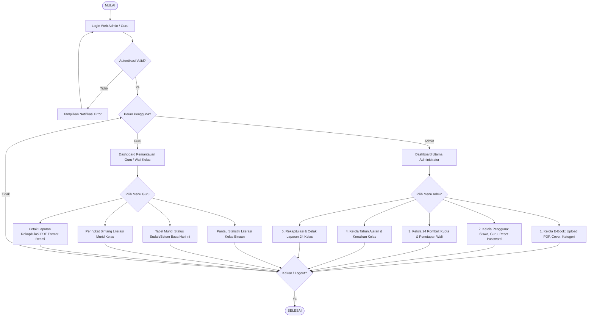
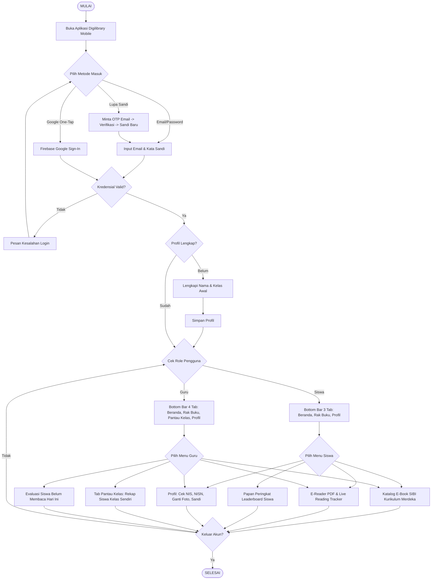

# 📊 Spesifikasi Flowchart Sistem — Digilibrary SD
> **Rujukan Visual: `Picture2.png`**  
> **Cakupan Sistem: Alur Web Admin/Guru, Alur Mobile Siswa/Guru, & 5 Sub-Proses Utama**

Dokumen ini menjelaskan alur logika sistem dari mulai login pengguna hingga proses bisnis inti literasi sekolah dasar.

---

## 1. Flowchart Induk A: Web Dashboard Admin & Guru

---

## 2. Flowchart Induk B: Aplikasi Mobile Android (Siswa & Guru)

---

## 3. Sub-Proses Utama Aplikasi

### Sub-Proses 1: Kelola E-Book & PDF (Admin)
`Pilih Menu E-Book` ➔ `Upload File PDF & Gambar Cover SIBI` ➔ `Isi Metadata (Judul, Penulis, Kelas 1-6, Kategori)` ➔ `Simpan ke Storage & Database MySQL` ➔ `Buku Aktif di Katalog`.

### Sub-Proses 2: Baca & Scroll Tracking 0–100% (Siswa)
`Pilih Buku` ➔ `Buka E-Reader PDF` ➔ `Deteksi Interaksi Sentuhan / Scroll Vertikal` ➔ `Timer Aktif Berjalan (Detik)` ➔ `Idle Detector (>60 detik diam = Jeda Otomatis)` ➔ `Kirim Sinkronisasi POST track-read per 30 Detik` ➔ `Database Update Durasi & Halaman Terakhir`.

### Sub-Proses 3: Sistem Poin & Leaderboard Membaca
`Siswa Membaca Hingga Halaman Terakhir (100%)` ➔ `Sistem Tandai Buku Selesai` ➔ `Akumulasi Total Buku & Durasi Menit` ➔ `Urutkan Peringkat Kelas` ➔ `Peringkat 1: Bintang Literasi #1` ➔ `Peringkat 2 & 3: Juara Baca #2 & #3` ➔ `Tampil di Leaderboard`.

### Sub-Proses 4: Rekap & Cetak Laporan Literasi PDF
`Pilih Kelas & Tahun Ajaran` ➔ `Sistem Menghitung Total Siswa Aktif, Rata-rata Progres %, Total Durasi` ➔ `Susun Data Prestasi Siswa & Catatan Wali Kelas` ➔ `Buka Modal Cetak Laporan` ➔ `Render Dokumen Format A4 (Kop Madrasah & Tanda Tangan)` ➔ `Cetak / Unduh PDF`.

### Sub-Proses 5: Tutup Tahun Ajaran & Kenaikan Kelas (24 Rombel)
`Admin Buka Manajemen Kelas` ➔ `Buat Tahun Ajaran Baru (Misal: 2026/2027)` ➔ `Sistem Otomatis Generate 24 Rombel (1A s/d 6C)` ➔ `Siswa Kelas 1-5 Naik Tingkat (Status: naik_kelas)` ➔ `Siswa Kelas 6 Dinyatakan Lulus (Status: lulus)` ➔ `Admin Menetapkan Ulang Wali Kelas Baru`.