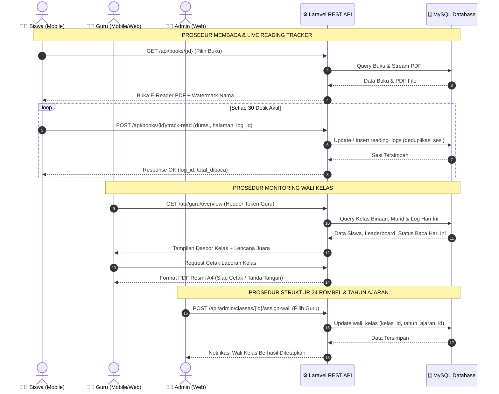

# 🗺️ Spesifikasi Flow Map (Bagan Alir Dokumen & Prosedur) — Digilibrary SD
> **Rujukan Visual: `Picture3.png`**  
> **Entitas: Siswa (Mobile), Guru (Mobile/Web), Web Admin, Laravel REST API, & Database MySQL**

Dokumen ini memetakan aliran pertukaran data dan prosedur dokumen fisik/digital antar entitas dalam sistem perpustakaan digital Digilibrary SD.

---

## 1. Matriks Entitas Pelaku (Swimlane)

1. **Siswa (Mobile Android)**: Mengakses katalog, membaca e-book PDF, memicu timer membaca, melihat profil dan peringkat.
2. **Guru / Wali Kelas (Mobile & Web)**: Memantau keaktifan siswa kelas binaannya dan mencetak laporan rekapitulasi literasi.
3. **Web Admin (Browser)**: Mengelola master buku, master pengguna, kapasitas kuota 24 kelas, dan tahun ajaran.
4. **Backend REST API (Laravel 11)**: Memvalidasi request, menghitung kalkulasi persentase dan poin leaderboard, mengelola session token Sanctum.
5. **Database (MySQL)**: Menyimpan tabel data relasional secara persisten (`users`, `books`, `reading_logs`, `kelas`, dll).

---

## 2. Tabel 8 Prosedur Utama Alur Sistem

| No | Nama Prosedur | Entitas Input | Proses Sistem (API & Controller) | Entitas Penyimpanan | Output / Dokumen |
| :-: | :--- | :--- | :--- | :--- | :--- |
| **1** | **Mengakses & Autentikasi** | Siswa / Guru / Admin | `POST /api/auth/login` atau `POST /api/auth/google` memvalidasi kredensial / Firebase token dan menerbitkan Sanctum Bearer Token. | Query tabel `users` | Token sesi aktif & Beranda Dasbor sesuai role. |
| **2** | **Eksplorasi Katalog Buku** | Siswa / Guru | `GET /api/books` dengan parameter filter kategori, tingkat kelas (1–6), dan kata kunci pencarian. | Query tabel `books` & `categories` | Grid kartu buku SIBI dengan cover dan rating. |
| **3** | **Membaca E-Book PDF** | Siswa | Request pembaca memuat URL file PDF `GET /api/books/{id}/stream` dengan dynamic watermark nama & tanggal. | Storage Disk `storage/books/*.pdf` | Kanvas pembaca PDF scroll vertikal. |
| **4** | **Pelacakan Progres Membaca** | Siswa (Live Tracking) | Sensor sentuhan + timer mengirimkan `POST /api/books/{id}/track-read` setiap 30 detik (durasi & halaman). | Update baris tabel `reading_logs` | Progres membaca real-time (0–100%). |
| **5** | **Penyelesaian Bacaan & Leaderboard** | Siswa (Halaman Terakhir) | Progres mencapai 100% memicu akumulasi total buku selesai dan memperbarui peringkat mingguan. | Update `reading_logs` & hitung ranking | Notifikasi *"Selamat! Buku Selesai"* & update lencana bintang. |
| **6** | **Pengelolaan Koleksi E-Book** | Web Admin | Form `POST /api/admin/books` memvalidasi file PDF & gambar cover, mengunggah ke storage public. | Insert tabel `books` & simpan file storage | E-Book baru tampil di seluruh perangkat. |
| **7** | **Monitoring Kelas Wali** | Guru / Wali Kelas | `GET /api/guru/overview` memfilter data murid satu rombel binaan, mengecek status baca hari ini. | Relasi `wali_kelas`, `siswa_kelas`, `reading_logs` | Tabel status harian & grafik rata-rata literasi. |
| **8** | **Rekapitulasi & Cetak Laporan** | Guru / Admin | Pembuatan rekapitulasi data literasi semester, kop madrasah, tanda tangan wali & kepala madrasah. | Agregasi data `reading_logs` per kelas | **Dokumen Cetak PDF Rekapitulasi Literasi Resmi**. |

---

## 3. Diagram Flow Map Interaksi Sistem (Mermaid Sequence)

