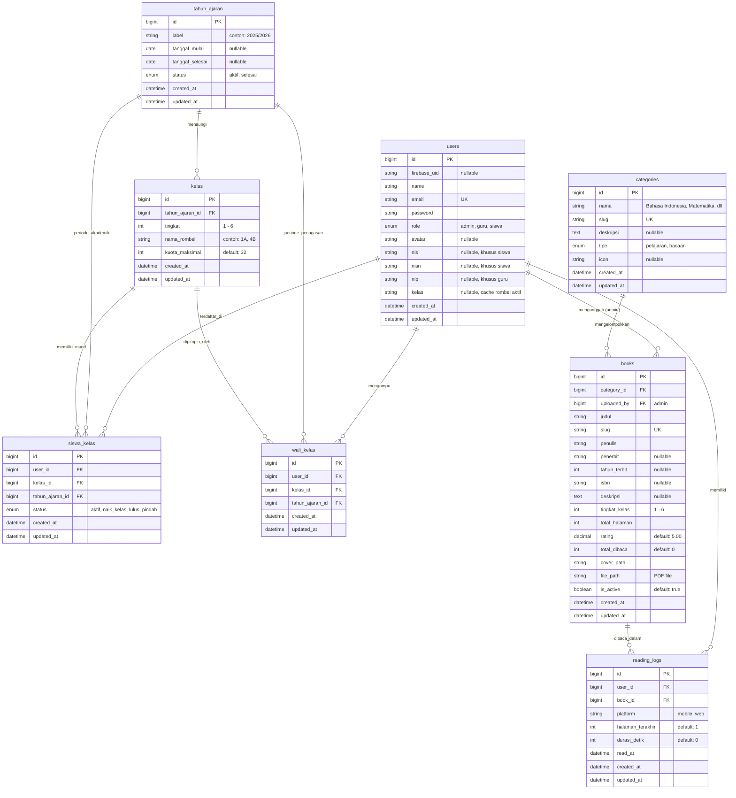

# 🗄️ Spesifikasi Entity Relationship Diagram (ERD) — Digilibrary SD
> **Rujukan Visual: `Picture4.png` & `Database/db_siperpus_mi (1).sql`**  
> **Basis Data: MySQL 8.x / MariaDB (Laravel 11 Eloquent ORM)**

Dokumen ini mendokumentasikan skema basis data relasional final yang mengintegrasikan kebutuhan e-library modern dan struktur akademik 24 rombel sekolah dasar.

---

## 1. Diagram Relasi Entitas (Mermaid ERD)

---

## 2. Kamus Data (Data Dictionary) Tabel Utama

### A. Tabel `users` (Entitas Pengguna Terpusat)
Menyimpan seluruh akun pengguna sistem dengan pembeda kolom `role`.
- `id` (BigInt, PK, Auto Increment)
- `firebase_uid` (VarChar 128, Nullable): UID otentikasi Google One-Tap Firebase.
- `name` (VarChar 150): Nama lengkap siswa, guru, atau admin.
- `email` (VarChar 150, Unique): Alamat email resmi.
- `role` (Enum: `'admin'`, `'guru'`, `'siswa'`): Peran otorisasi sistem.
- `nis` (VarChar 30, Nullable): Nomor Induk Siswa.
- `nisn` (VarChar 30, Nullable): Nomor Induk Siswa Nasional.
- `nip` (VarChar 30, Nullable): Nomor Induk Pegawai (khusus guru).
- `kelas` (VarChar 50, Nullable): String penanda rombel aktif (misal: "Kelas 4A") untuk backward-compatibility.
- `avatar` (VarChar 255, Nullable): Lokasi path / URL gambar profil pengguna.

### B. Tabel `tahun_ajaran` & `kelas` (Struktur 24 Rombel SD)
- **`tahun_ajaran`**: Menampung siklus tahun pelajaran (contoh: "2025/2026", status: `'aktif'`).
- **`kelas`**: Menyimpan 24 rombel Sekolah Dasar:
  - Tingkat 1: `1A`, `1B`, `1C`
  - Tingkat 2: `2A`, `2B`, `2C`
  - Tingkat 3: `3A`, `3B`, `3C`
  - Tingkat 4: `4A`, `4B`, `4C`
  - Tingkat 5: `5A`, `5B`, `5C`
  - Tingkat 6: `6A`, `6B`, `6C`
  - `kuota_maksimal`: Batas kapasitas murid per rombel (standar: 32 siswa).

### C. Tabel `siswa_kelas` & `wali_kelas` (Riwayat Kenaikan & Penugasan)
- **`siswa_kelas`**: Relasi banyak-ke-banyak antara siswa dan kelas per tahun ajaran dengan status (`'aktif'`, `'naik_kelas'`, `'lulus'`, `'pindah'`).
- **`wali_kelas`**: Relasi satu guru memimpin satu kelas pada tahun ajaran aktif. Constraint unik pada `kelas_id + tahun_ajaran_id`.

### D. Tabel `books` & `reading_logs` (Katalog & Pelacakan Baca)
- **`books`**: Menyimpan katalog e-book resmi SIBI Kemendikdasmen beserta referensi cover image dan file PDF.
- **`reading_logs`**: Menyimpan riwayat baca live (`durasi_detik`, `halaman_terakhir`, `platform: 'mobile'/'web'`).