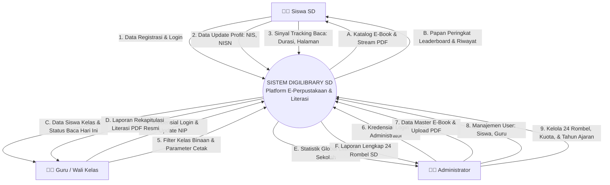
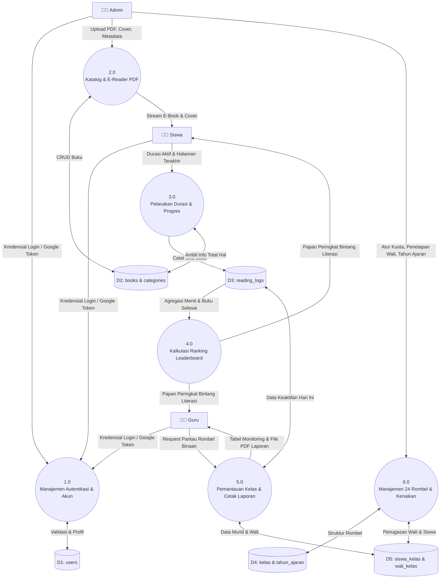

# 🔄 Spesifikasi Data Flow Diagram (DFD) — Digilibrary SD
> **Level: DFD Level 0 (Context Diagram) & DFD Level 1 (Dekomposisi Sistem)**  
> **Notasi: Yourdon & DeMarco / Gane & Sarson**

Dokumen ini memetakan transformasi masukan data menjadi keluaran informasi pada sistem Digilibrary SD.

---

## 1. DFD Level 0 (Context Diagram)

Diagram Konteks menggambarkan batasan sistem Digilibrary SD dan interaksinya dengan 3 entitas luar:

---

## 2. DFD Level 1 (Dekomposisi Proses Utama)

---

## 3. Kamus Data Aliran Data (Data Flow Dictionary)

1. **`Data_Tracking_Baca`**:
   `user_id + book_id + platform + durasi_detik + halaman_terakhir + read_at + (log_id)`
2. **`Data_Siswa_Kelas`**:
   `user_id + nama + nis + nisn + status_hari_ini + durasi_menit + books_completed + avg_progress`
3. **`Data_Laporan_Resmi_PDF`**:
   `nomor_surat + tahun_ajaran + semester + rombel + wali_kelas + daftar_murid[nama, nis, nisn, durasi, progres, lencana] + ttd_wali + ttd_kepala_sekolah`