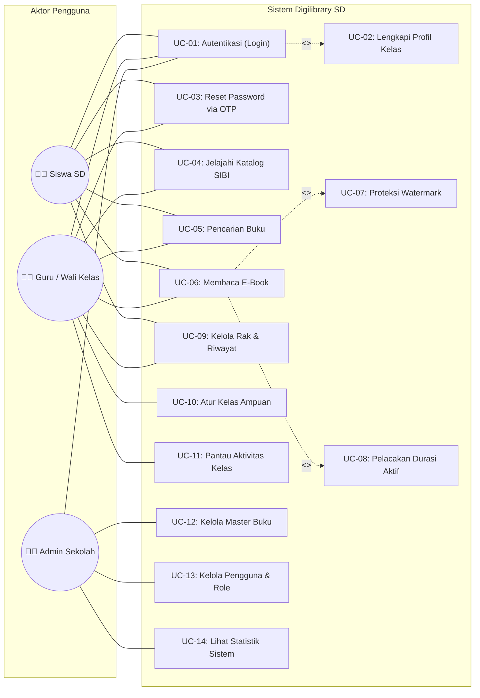
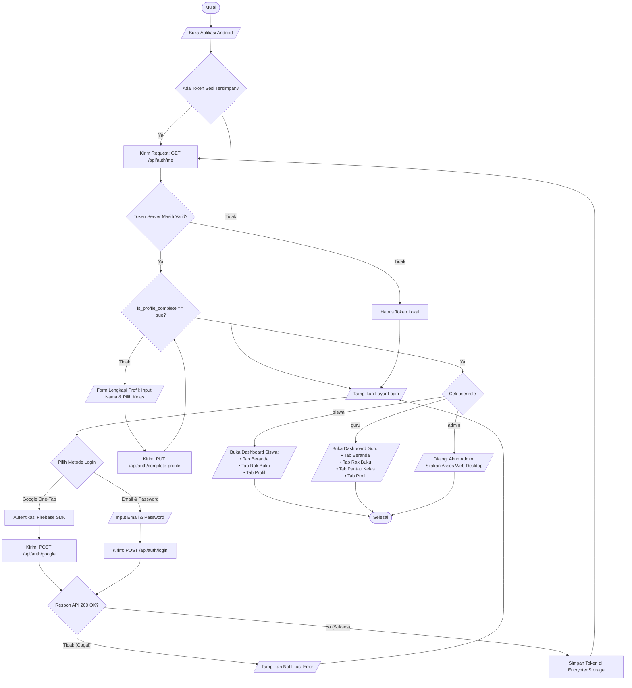
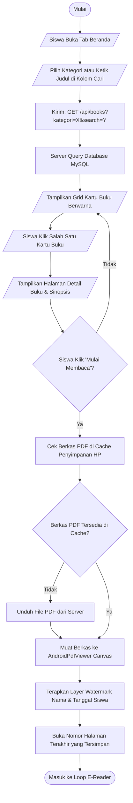
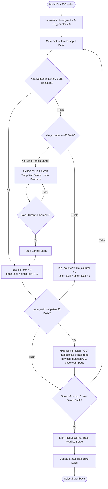
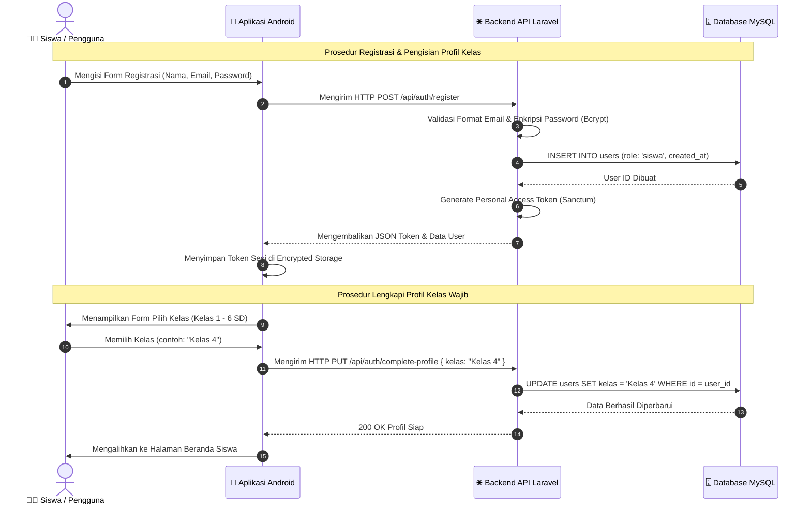
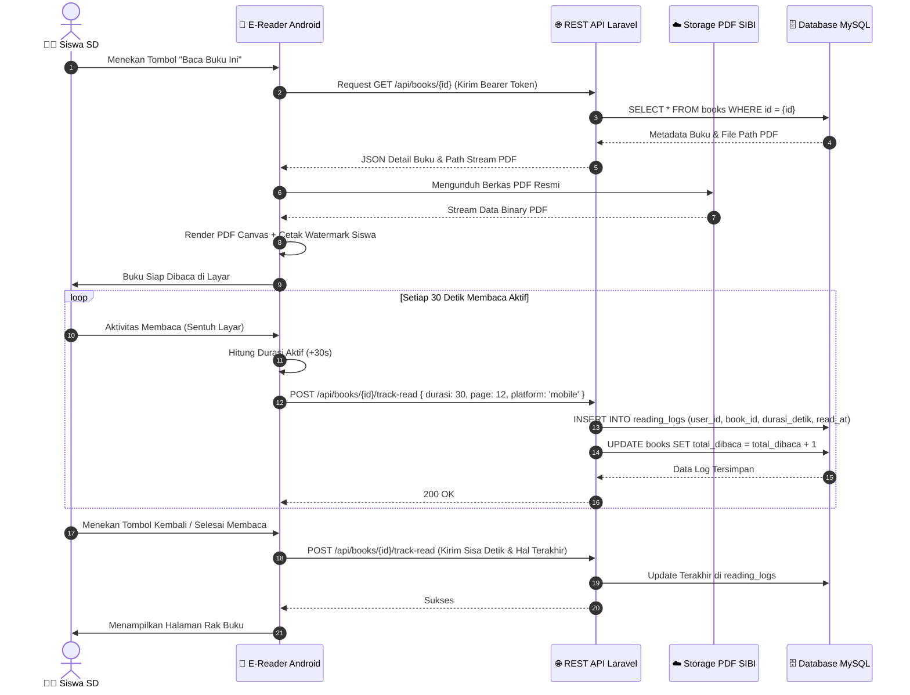
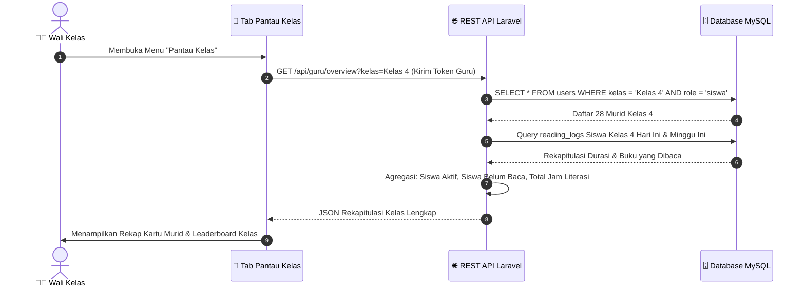
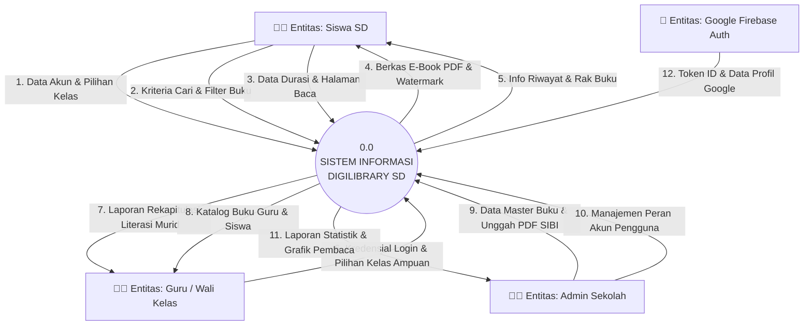
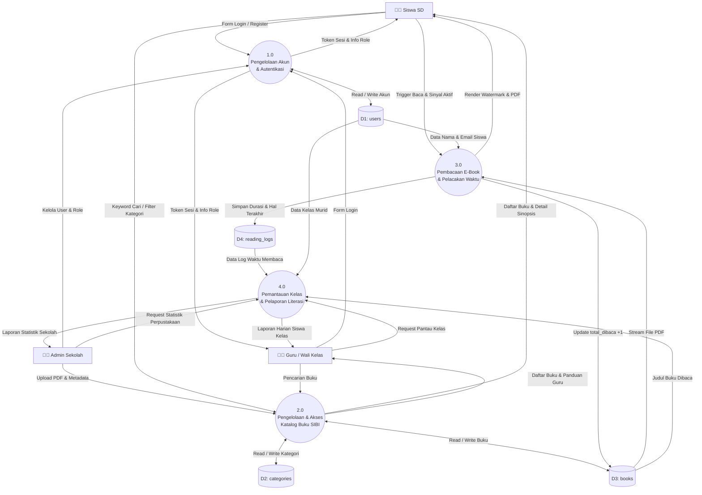
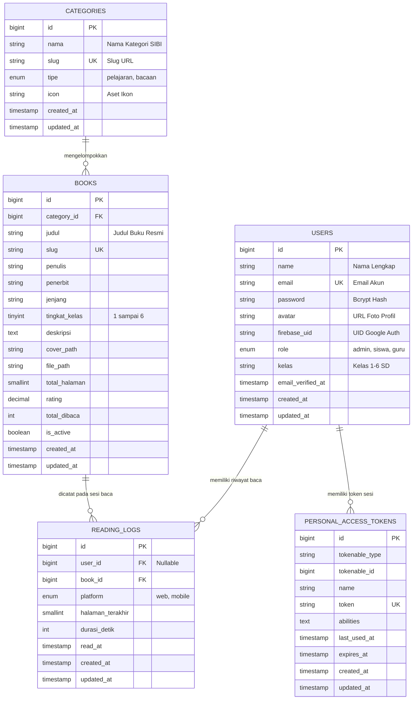

# 📘 Buku Panduan Arsitektur & Desain Sistem - Digilibrary SD
> **Dokumen Referensi Perancangan Diagram Rekayasa Perangkat Lunak**  
> Disusun khusus sebagai panduan pembuatan **Use Case Diagram, Flowchart, Flow Map, Data Flow Diagram (DFD), dan Entity Relationship Diagram (ERD)** yang diekstraksi langsung dari implementasi nyata sistem **Digilibrary SD** (Backend Laravel & Mobile Android Kotlin).

---

## 📑 Daftar Isi
1. [Bedah Sistem: Fitur & Modul Nyata Digilibrary SD](#1-bedah-sistem-fitur--modul-nyata-digilibrary-sd)
2. [Panduan 1: Use Case Diagram](#2-panduan-1-use-case-diagram)
   - [Komponen Penyusun Use Case](#a-komponen-penyusun-use-case)
   - [Daftar Kasus Penggunaan (Use Case List)](#b-daftar-kasus-penggunaan-use-case-list)
   - [Diagram Visual Use Case (Mermaid)](#c-diagram-visual-use-case)
   - [Skenario Use Case Utama (Use Case Specifications)](#d-skenario-use-case-utama)
3. [Panduan 2: Flowchart (Diagram Alir Aktivitas)](#3-panduan-2-flowchart-diagram-alir-aktivitas)
   - [Simbol & Komponen Standar Flowchart](#a-simbol--komponen-standar-flowchart)
   - [Flowchart 1: Autentikasi & Dynamic Role Navigation](#b-flowchart-1-autentikasi--dynamic-role-navigation)
   - [Flowchart 2: Eksplorasi Katalog & Membaca E-Book](#c-flowchart-2-eksplorasi-katalog--membaca-e-book)
   - [Flowchart 3: Live Reading Tracker & Idle Detector (Anti-Curang)](#d-flowchart-3-live-reading-tracker--idle-detector)
   - [Flowchart 4: Pemantauan Kelas oleh Wali Kelas](#e-flowchart-4-pemantauan-kelas-oleh-wali-kelas)
4. [Panduan 3: Flow Map (Bagan Alir Dokumen & Prosedur)](#4-panduan-3-flow-map-bagan-alir-dokumen--prosedur)
   - [Simbol & Komponen Standar Flow Map](#a-simbol--komponen-standar-flow-map)
   - [Pembagian Entitas / Kolom Swimlane](#b-pembagian-entitas--kolom-swimlane)
   - [Flow Map 1: Prosedur Registrasi & Pengisian Profil Kelas](#c-flow-map-1-prosedur-registrasi--profil-kelas)
   - [Flow Map 2: Prosedur Peminjaman/Membaca Buku Digital](#d-flow-map-2-prosedur-membaca-buku-digital)
   - [Flow Map 3: Prosedur Monitoring & Pelaporan Literasi Siswa](#e-flow-map-3-prosedur-monitoring--pelaporan-literasi)
5. [Panduan 4: Data Flow Diagram (DFD)](#5-panduan-4-data-flow-diagram-dfd)
   - [Simbol & Komponen Standar DFD (Notasi Gane & Sarson / Yourdon)](#a-simbol--komponen-standar-dfd)
   - [DFD Level 0: Diagram Konteks (Context Diagram)](#b-dfd-level-0-diagram-konteks)
   - [DFD Level 1: Dekomposisi Proses Utama](#c-dfd-level-1-dekomposisi-proses-utama)
   - [Kamus Data (Data Dictionary) Aliran Data](#d-kamus-data-data-dictionary-aliran-data)
6. [Panduan 5: Entity Relationship Diagram (ERD)](#6-panduan-5-entity-relationship-diagram-erd)
   - [Komponen Penyusun ERD](#a-komponen-penyusun-erd)
   - [Struktur Tabel Nyata Database MySQL](#b-struktur-tabel-nyata-database-mysql)
   - [Diagram Relasi ERD Visual (Crow's Foot)](#c-diagram-relasi-erd-visual)
   - [Matriks Kardinalitas & Integritas Relasional](#d-matriks-kardinalitas--integritas-relasional)
7. [Panduan Praktis Pemindahan ke Draw.io / Visio / Word](#7-panduan-praktis-pemindahan-ke-drawio--visio--word)

---

## 1. Bedah Sistem: Fitur & Modul Nyata Digilibrary SD

Digilibrary SD adalah platform perpustakaan digital khusus Sekolah Dasar yang menyajikan buku resmi SIBI Kemendikdasmen (Kurikulum Merdeka). Sistem ini memiliki 3 entitas pengguna dengan fungsi yang berbeda:

### A. Tiga Aktor Utama
1. **👨‍🎓 Siswa SD**:
   - Masuk menggunakan Google One-Tap (Firebase) atau Email/Password.
   - Pendaftaran akun baru otomatis menghasilkan `role = "siswa"`.
   - Mengisi profil wajib (Nama Lengkap & Pilihan Kelas 1 s/d 6 SD).
   - Menjelajahi buku menurut 5 kategori SIBI dan tingkat kelas.
   - Membaca e-book di E-Reader dengan watermark nama anti-pembajakan.
   - Aktivitas durasi membaca dicatat otomatis via *Live Reading Tracker* yang memiliki sensor diam (*Idle Detector*).
   - Melihat rak buku, riwayat baca, dan progres persentase halaman.
2. **👩‍🏫 Guru / Wali Kelas**:
   - Berstatus `role = "guru"` (ditetapkan oleh Admin Sekolah).
   - Memilih/mengatur kelas yang diampu (misal: "Kelas 4").
   - Memiliki seluruh fitur Siswa (membaca buku siswa & buku panduan guru).
   - Memiliki fitur khusus **"Pantau Kelas"**: melihat daftar murid di kelasnya, memantau siapa yang sudah membaca hari ini, durasi menit membaca, dan buku terakhir yang dibaca.
3. **👨‍💼 Admin Sekolah**:
   - Berstatus `role = "admin"`.
   - Mengakses Dashboard Web Desktop untuk:
     - CRUD Data Buku SIBI (unggah PDF, cover, sinopsis, tingkat kelas, kategori).
     - CRUD Pengguna (membuat akun, ubah role siswa menjadi guru, reset password).
     - Melihat statistik perpustakaan (total buku, total pembaca, grafik baca).

---

## 2. Panduan 1: Use Case Diagram

Use Case Diagram menggambarkan fungsionalitas sistem dari sudut pandang pengguna eksternal (aktor).

### A. Komponen Penyusun Use Case
Saat menggambar di Draw.io / StarUML / Visio, gunakan 4 komponen berikut:
1. **Actor (Aktor)**: Disimbolkan dengan *Stick Figure*. Merepresentasikan pihak yang berinteraksi dengan sistem (Siswa, Guru, Admin, Google Auth API).
2. **Use Case**: Disimbolkan dengan bentuk *Oval*. Merepresentasikan fungsi/layanan spesifik yang diawali kata kerja (contoh: *Melakukan Login*, *Membaca Buku Digital*).
3. **System Boundary**: Disimbolkan dengan *Kotak Persegi Panjang* besar yang membungkus semua use case, dengan judul sistem di bagian atas. Aktor diletakkan di **luar** kotak.
4. **Relasi (Relationships)**:
   - **Association (Asosiasi)**: Garis lurus tanpa panah yang menghubungkan Aktor dengan Use Case yang diaksesnya.
   - **`<<include>>`**: Panah putus-putus terbuka bertuliskan `<<include>>`. Menandakan bahwa use case sumber **pasti dan wajib** menjalankan use case tujuan (Contoh: *Membaca Buku* `<<include>>` *Menjalankan Live Reading Tracker*).
   - **`<<extend>>`**: Panah putus-putus bertuliskan `<<extend>>`. Menandakan use case yang bersifat opsional/kondisional (Contoh: *Login Sistem* `<<extend>>` *Melengkapi Profil Siswa Baru*).

---

### B. Daftar Kasus Penggunaan (Use Case List)

| ID | Nama Use Case | Aktor Terlibat | Tipe Relasi | Keterangan Fungsional |
| :--- | :--- | :--- | :---: | :--- |
| **UC-01** | Autentikasi Pengguna (Login) | Siswa, Guru, Admin | - | Masuk via Google One-Tap atau Email & Password. |
| **UC-02** | Lengkapi Profil Akun | Siswa, Guru | `<<extend>>` UC-01 | Pengisian nama & jenjang kelas saat login pertama. |
| **UC-03** | Reset Password via OTP | Siswa, Guru | - | Meminta kode OTP email untuk memulihkan password. |
| **UC-04** | Jelajahi Katalog Buku SIBI | Siswa, Guru | - | Melihat daftar buku berdasarkan 5 kategori & tingkat kelas. |
| **UC-05** | Pencarian Buku | Siswa, Guru | - | Mencari buku berdasarkan judul, penulis, atau kata kunci. |
| **UC-06** | Membaca Buku Digital (E-Reader) | Siswa, Guru | - | Membuka kanvas PDF dan membaca halaman per halaman. |
| **UC-07** | Terapkan Watermark Proteksi | Sistem | `<<include>>` UC-06 | Menimpa identitas siswa di atas kanvas PDF secara otomatis. |
| **UC-08** | Lacak Durasi Baca Aktif | Sistem | `<<include>>` UC-06 | Menghitung waktu aktif dengan sensor auto-pause 60s. |
| **UC-09** | Kelola Rak Buku & Riwayat | Siswa, Guru | - | Melihat daftar buku yang sedang dibaca dan progres halaman. |
| **UC-10** | Atur Kelas Ampuan Guru | Guru | - | Menentukan kelas yang menjadi tanggung jawab wali kelas. |
| **UC-11** | Pantau Aktivitas Literasi Kelas | Guru | - | Melihat rekap siswa yang sudah membaca hari ini. |
| **UC-12** | Kelola Master Data Buku SIBI | Admin | - | Tambah, ubah, hapus metadata dan file PDF buku. |
| **UC-13** | Kelola Akun & Hak Akses Pengguna | Admin | - | Mengubah role user, reset password, hapus user. |
| **UC-14** | Lihat Statistik Perpustakaan | Admin | - | Melihat total pembaca, buku terpopuler, dan grafik. |

---

### C. Diagram Visual Use Case



---

### D. Skenario Use Case Utama (Use Case Specifications)

Contoh 2 tabel spesifikasi use case yang wajib ada di laporan/skripsi:

#### 1. Skenario: UC-06 (Membaca Buku Digital & Pelacakan Aktif)
- **Aktor Utama**: Siswa SD
- **Deskripsi**: Siswa membuka buku digital pilihan dan membaca melalui PDF canvas dengan perekaman waktu membaca anti-curang.
- **Prekondisi**: Siswa telah berhasil login dan memilih buku dari katalog.
- **Postkondisi**: Durasi membaca bertambah pada `reading_logs`, counter `total_dibaca` buku naik, dan riwayat halaman tersimpan.
- **Skenario Normal (Main Flow)**:
  1. Siswa menekan tombol "Mulai Membaca" pada halaman detail buku.
  2. Sistem mengunduh/memuat berkas PDF resmi dari server.
  3. Sistem merender kanvas PDF dan menempelkan watermark nama, email, dan tanggal siswa.
  4. Sistem menginisialisasi timer membaca aktif (`active_timer = 0`, `idle_timer = 0`).
  5. Siswa membaca dan membalik halaman.
  6. Setiap ada sentuhan layar, sistem mereset `idle_timer = 0` dan menambah `active_timer + 1`.
  7. Setiap interval 30 detik aktif, sistem mengirim data durasi ke API backend di background.
  8. Siswa menekan tombol selesai/kembali.
  9. Sistem mengirim sinkronisasi durasi terakhir dan menyimpan nomor halaman terakhir dibaca.
- **Skenario Alternatif (Idle Detector Triggered)**:
  - Pada langkah 6, jika layar tidak disentuh selama > 60 detik:
    1. Sistem menjeda `active_timer`.
    2. Sistem memunculkan banner pemberitahuan bahwa sesi membaca dijeda.
    3. Ketika siswa menyentuh layar kembali, timer aktif melanjutkan hitungan.

#### 2. Skenario: UC-11 (Memantau Aktivitas Literasi Kelas)
- **Aktor Utama**: Guru / Wali Kelas
- **Deskripsi**: Wali kelas memantau keaktifan membaca murid-murid di kelas ampuannya hari ini.
- **Prekondisi**: Guru memiliki `role = "guru"` dan telah menentukan kelas ampuannya (misal: "Kelas 4").
- **Postkondisi**: Guru mendapatkan informasi real-time mengenai status literasi murid.
- **Skenario Normal**:
  1. Guru membuka tab navigasi "Pantau Kelas".
  2. Aplikasi mengirim permintaan `GET /api/guru/overview?kelas={nama_kelas}` dengan Bearer Token.
  3. Sistem mengumpulkan data murid terdaftar di kelas tersebut, mengagregasikan log membaca hari ini, dan menghitung total menit membaca minggu ini.
  4. Sistem menampilkan kartu ringkasan (Total Murid, Murid Sudah Membaca, Murid Belum Membaca).
  5. Guru dapat melihat detail nama murid beserta judul buku yang terakhir dibaca.

---

## 3. Panduan 2: Flowchart (Diagram Alir Aktivitas)

Flowchart menggambarkan urutan langkah logika, percabangan keputusan, dan proses komputasi dalam sistem.

### A. Simbol & Komponen Standar Flowchart
1. **Terminator (Oval / Kapsul)**: Menandai awal (`Mulai / Start`) dan akhir (`Selesai / End`) dari sebuah alur.
2. **Process (Persegi Panjang)**: Langkah pemrosesan data, kalkulasi, atau aksi sistem (contoh: *Hitung durasi + 1 detik*, *Simpan token*).
3. **Decision (Belah Ketupat / Diamond)**: Titik evaluasi kondisi logika yang menghasilkan cabang minimal 2 arah: `Ya / Tidak` atau `True / False`.
4. **Input / Output (Jajaran Genjang)**: Proses memasukkan data oleh pengguna atau menampilkan informasi (contoh: *Input email & password*, *Tampilkan katalog buku*).
5. **Predefined Process / Subrutin (Kotak Bergaris Samping Ganda)**: Memanggil prosedur yang sudah didefinisikan secara terpisah (contoh: *Panggil API Auth Google*).
6. **Connector (Lingkaran Kecil)**: Menyambungkan alur pada lembar yang sama.
7. **Flowline (Garis Berpanah)**: Menunjukkan arah jalannya instruksi dari satu simbol ke simbol berikutnya.

---

### B. Flowchart 1: Autentikasi & Dynamic Role Navigation
Menjelaskan logika saat aplikasi dibuka, login, validasi profil, dan pembagian menu peran:



---

### C. Flowchart 2: Eksplorasi Katalog & Membaca E-Book
Menjelaskan alur saat murid mencari buku hingga membaca di kanvas PDF:



---

### D. Flowchart 3: Live Reading Tracker & Idle Detector
Menjelaskan logika anti-curang pada waktu membaca aktif murid:



---

### E. Flowchart 4: Pemantauan Kelas oleh Wali Kelas
Menjelaskan alur guru memantau keaktifan membaca murid kelasnya:

```mermaid
flowchart TD
    A([Mulai]) --> B[/Guru Klik Tab 'Pantau Kelas'/]
    B --> C[Cek Parameter Kelas Ampuan Guru di Profil]
    C --> D[Kirim: GET /api/guru/overview?kelas={nama_kelas}]
    D --> E[Server Mengambil Data Seluruh Siswa di Kelas Tersebut]
    E --> F[Server Menghitung Log Membaca Hari Ini & Minggu Ini]
    F --> G[/Tampilkan Kartu Statistik:<br>• Jumlah Siswa Aktif Hari Ini<br>• Total Jam Literasi Kelas/]
    G --> H[/Tampilkan Tabel Status Murid:<br>• Nama Siswa<br>• Status: Sudah/Belum Membaca<br>• Menit Membaca Hari Ini<br>• Judul Buku Terakhir/]
    H --> I([Selesai])
```

---

## 4. Panduan 3: Flow Map (Bagan Alir Dokumen & Prosedur)

Flow Map (Bagan Alir Sistem / Prosedur Dokumen) menggambarkan aliran fisik dokumen, data, dan aksi antar bagian/entitas dalam sistem.

### A. Simbol & Komponen Standar Flow Map
1. **Swimlane / Kolom Bagian**: Kolom vertikal yang membagi tanggung jawab tiap bagian (contoh: *Siswa/Guru*, *Aplikasi Android*, *API Server Laravel*, *Database MySQL*).
2. **Dokumen (Document)**: Bentuk persegi panjang dengan bagian bawah bergelombang. Merepresentasikan data formulir, token, berkas PDF, atau laporan fisik/digital.
3. **Proses Manual (Manual Operation)**: Bentuk trapesium terbalik. Merepresentasikan aktivitas fisik manusia (contoh: *Siswa membaca buku*, *Guru memeriksa nilai*).
4. **Proses Komputerisasi (Process)**: Persegi panjang biasa. Merepresentasikan proses komputasi sistem (contoh: *Verifikasi password*, *Hitung agregasi log*).
5. **Database / File Storage (Cylinder / Data Store)**: Silinder database relasional atau direktori penyimpanan berkas PDF.
6. **Arsip / Simpanan (Storage/Archive)**: Segitiga terbalik (arsip offline) atau silinder (basis data).
7. **Garis Alir & Konektor**: Panah yang menghubungkan alur dokumen antar kolom.

---

### B. Pembagian Entitas / Kolom Swimlane
Sistem Digilibrary SD memiliki 4 entitas kolom utama dalam Flow Map:
1. **Kolom 1: Aktor Pengguna** (Siswa SD / Guru Wali Kelas)
2. **Kolom 2: Antarmuka Klien** (Aplikasi Android Kotlin / Web Desktop)
3. **Kolom 3: Layanan Backend** (Laravel 11 REST API Controller & Sanctum)
4. **Kolom 4: Basis Data & Storage** (MySQL Relasional & Disk PDF Storage)

---

### C. Flow Map 1: Prosedur Registrasi & Profil Kelas
Menjelaskan aliran formulir pendaftaran dan validasi profil kelas baru:



---

### D. Flow Map 2: Prosedur Membaca Buku Digital
Menjelaskan alur permohonan file buku, verifikasi, rendering watermark, dan pencatatan log sesi baca:



---

### E. Flow Map 3: Prosedur Monitoring & Pelaporan Literasi
Menjelaskan aliran dokumen laporan aktivitas membaca murid ke wali kelas:



---

## 5. Panduan 4: Data Flow Diagram (DFD)

Data Flow Diagram (DFD / DAD) menggambarkan arus pergerakan data dari entitas luar, melalui proses transformasi komputasi, menuju simpanan data (data store).

### A. Simbol & Komponen Standar DFD (Notasi Gane & Sarson / Yourdon)
1. **Entitas Luar (External Entity / Terminator)**: Disimbolkan dengan *Persegi Panjang*. Sumber atau tujuan data di luar batas sistem (Contoh: *Siswa*, *Guru*, *Admin*, *Google Auth API*).
2. **Proses (Process)**: Disimbolkan dengan *Lingkaran* (Notasi Yourdon) atau *Persegi Sudut Tumpul* (Notasi Gane & Sarson) dengan nomor identifikasi proses di bagian atas (Contoh: `1.0`, `2.0`, `3.0`).
3. **Simpanan Data (Data Store)**: Disimbolkan dengan *Dua Garis Paralel Horizontal* terbuka atau huruf `D` diikuti nomor (Contoh: `D1: users`, `D2: categories`, `D3: books`, `D4: reading_logs`).
4. **Aliran Data (Data Flow)**: Panah berlabel nama data yang mengalir (Contoh: *Data_Login*, *Data_Buku*, *Log_Membaca*).

---

### B. DFD Level 0: Diagram Konteks (Context Diagram)

Diagram Konteks memandang seluruh sistem Digilibrary SD sebagai satu kesatuan proses tunggal (`0.0 Sistem Informasi Digilibrary SD`) yang dihubungkan dengan seluruh entitas eksternal:



---

### C. DFD Level 1: Dekomposisi Proses Utama

Dekomposisi proses `0.0` menjadi 4 proses inti beserta data store yang terlibat:



---

### D. Kamus Data (Data Dictionary) Aliran Data

Format struktur data yang mengalir pada DFD:

1. **`Data_Registrasi`**:
   - `nama` = *String (max 255)*
   - `email` = *String (valid email format, unique)*
   - `password` = *String (min 8 karakter)*
   - `kelas` = *String (enum: 'Kelas 1' s/d 'Kelas 6')*
2. **`Data_Track_Membaca`**:
   - `user_id` = *Integer (FK users.id)*
   - `book_id` = *Integer (FK books.id)*
   - `durasi_detik` = *Integer (akumulasi sesi aktif, misal: 30)*
   - `halaman_terakhir` = *Integer (nomor halaman saat ini)*
   - `platform` = *Enum ('mobile', 'web')*
   - `read_at` = *Timestamp (waktu sesi berlangsung)*
3. **`Data_Laporan_Guru`**:
   - `nama_kelas` = *String*
   - `total_siswa` = *Integer*
   - `siswa_aktif_hari_ini` = *Integer*
   - `rekap_siswa` = *Array of [nama, status_baca, menit_hari_ini, judul_buku]*

---

## 6. Panduan 5: Entity Relationship Diagram (ERD)

ERD menggambarkan struktur logis basis data relasional, entitas tabel, atribut kolom, kunci utama (Primary Key), kunci tamu (Foreign Key), dan kardinalitas antar tabel.

### A. Komponen Penyusun ERD
1. **Entitas (Entity)**: Tabel data yang menyimpan objek independen (disimbolkan dengan kotak persegi panjang).
2. **Atribut (Attribute)**: Kolom-kolom di dalam entitas.
   - **Primary Key (PK)**: Pengenal unik record (contoh: `id`).
   - **Foreign Key (FK)**: Kunci penghubung ke entitas lain (contoh: `category_id`, `user_id`, `book_id`).
3. **Kardinalitas (Cardinality)**: Menggunakan notasi **Crow's Foot**:
   - `||--o{` : Relasi **One-to-Many (1 ke N)**. Satu record di entitas kiri dapat memiliki 0, 1, atau banyak record di entitas kanan.
   - `||--||` : Relasi **One-to-One (1 ke 1)**.

---

### B. Struktur Tabel Nyata Database MySQL
Diekstraksi langsung dari berkas migrasi Laravel pada `database/migrations/`:

#### 1. Tabel: `users`
| Kolom | Tipe Data | Constraint | Keterangan |
| :--- | :--- | :--- | :--- |
| `id` | BIGINT UNSIGNED | PK, Auto Increment | Identitas unik pengguna |
| `name` | VARCHAR(255) | NOT NULL | Nama lengkap siswa / guru / admin |
| `email` | VARCHAR(255) | UNIQUE, NOT NULL | Alamat email akun |
| `password` | VARCHAR(255) | NULLABLE | Hash bcrypt kata sandi (null jika pure Google) |
| `avatar` | VARCHAR(255) | NULLABLE | URL foto profil dari Google atau storage lokal |
| `firebase_uid` | VARCHAR(255) | NULLABLE | UID unik Google Firebase Auth |
| `role` | ENUM('admin','siswa','guru') | DEFAULT 'siswa' | Hak akses peran pengguna |
| `kelas` | VARCHAR(50) | NULLABLE | Kelas siswa / kelas ampuan guru (e.g. 'Kelas 4') |
| `email_verified_at`| TIMESTAMP | NULLABLE | Waktu verifikasi email |
| `created_at`, `updated_at` | TIMESTAMP | NULLABLE | Waktu pembuatan & modifikasi |

#### 2. Tabel: `categories`
| Kolom | Tipe Data | Constraint | Keterangan |
| :--- | :--- | :--- | :--- |
| `id` | BIGINT UNSIGNED | PK, Auto Increment | Identitas unik kategori |
| `nama` | VARCHAR(255) | NOT NULL | Nama kategori (Pelajaran SD, Cerita Fabel) |
| `slug` | VARCHAR(255) | UNIQUE, NOT NULL | Slug URL unik |
| `tipe` | ENUM('pelajaran','bacaan') | DEFAULT 'bacaan' | Klasifikasi tipe kategori buku |
| `icon` | VARCHAR(255) | NULLABLE | Ikon aset SVG / Lucide |
| `created_at`, `updated_at` | TIMESTAMP | NULLABLE | Waktu pembuatan & modifikasi |

#### 3. Tabel: `books`
| Kolom | Tipe Data | Constraint | Keterangan |
| :--- | :--- | :--- | :--- |
| `id` | BIGINT UNSIGNED | PK, Auto Increment | Identitas unik buku |
| `category_id` | BIGINT UNSIGNED | FK ke `categories.id` | Kategori induk buku |
| `judul` | VARCHAR(255) | NOT NULL | Judul resmi buku SIBI |
| `slug` | VARCHAR(255) | UNIQUE, NOT NULL | Slug URL judul |
| `penulis` | VARCHAR(255) | NOT NULL | Penulis / Tim Pusat Perbukuan |
| `penerbit` | VARCHAR(255) | NOT NULL | Kemendikdasmen RI / Penerbit resmi |
| `jenjang` | VARCHAR(100) | NOT NULL | SD Kelas 1-3 / SD Kelas 4-6 |
| `tingkat_kelas`| TINYINT UNSIGNED | NOT NULL (1 s/d 6) | Angka tingkatan kelas murid |
| `deskripsi` | TEXT | NULLABLE | Sinopsis dan pengenalan isi buku |
| `cover_path` | VARCHAR(255) | NULLABLE | Lokasi path gambar sampul buku |
| `file_path` | VARCHAR(255) | NOT NULL | Lokasi path file PDF resmi buku |
| `total_halaman`| SMALLINT UNSIGNED | DEFAULT 0 | Jumlah total halaman PDF |
| `rating` | DECIMAL(3,2) | DEFAULT 5.00 | Nilai ulasan buku |
| `total_dibaca` | INT UNSIGNED | DEFAULT 0 | Counter akumulasi pembacaan |
| `is_active` | BOOLEAN | DEFAULT TRUE | Status visibilitas buku di katalog |
| `created_at`, `updated_at` | TIMESTAMP | NULLABLE | Waktu pembuatan & modifikasi |

#### 4. Tabel: `reading_logs`
| Kolom | Tipe Data | Constraint | Keterangan |
| :--- | :--- | :--- | :--- |
| `id` | BIGINT UNSIGNED | PK, Auto Increment | Identitas unik sesi log |
| `user_id` | BIGINT UNSIGNED | FK ke `users.id`, NULLABLE | Akun siswa yang membaca (null jika tamu) |
| `book_id` | BIGINT UNSIGNED | FK ke `books.id` | Buku yang dibaca |
| `platform` | ENUM('web','mobile') | DEFAULT 'mobile' | Perangkat yang digunakan untuk membaca |
| `halaman_terakhir`| SMALLINT UNSIGNED | DEFAULT 1 | Posisi halaman terakhir dibuka |
| `durasi_detik` | INT UNSIGNED | DEFAULT 0 | Waktu membaca aktif dalam detik |
| `read_at` | TIMESTAMP | NOT NULL | Waktu stempel sesi membaca dimulai |
| `created_at`, `updated_at` | TIMESTAMP | NULLABLE | Waktu pembuatan & modifikasi |

#### 5. Tabel: `personal_access_tokens` (Laravel Sanctum)
| Kolom | Tipe Data | Constraint | Keterangan |
| :--- | :--- | :--- | :--- |
| `id` | BIGINT UNSIGNED | PK, Auto Increment | Identitas unik token |
| `tokenable_type` | VARCHAR(255) | NOT NULL | `App\Models\User` |
| `tokenable_id` | BIGINT UNSIGNED | NOT NULL | ID User pemilik token |
| `name` | VARCHAR(255) | NOT NULL | Nama perangkat (misal: 'mobile-token') |
| `token` | VARCHAR(64) | UNIQUE, NOT NULL | SHA-256 hash dari bearer token |
| `abilities` | TEXT | NULLABLE | Hak akses token |
| `last_used_at` | TIMESTAMP | NULLABLE | Waktu terakhir token dipakai request API |
| `expires_at` | TIMESTAMP | NULLABLE | Waktu kadaluarsa token |
| `created_at`, `updated_at` | TIMESTAMP | NULLABLE | Waktu pembuatan & modifikasi |

---

### C. Diagram Relasi ERD Visual



---

### D. Matriks Kardinalitas & Integritas Relasional

1. **`CATEGORIES` ke `BOOKS` (1 : N)**:
   - *Penjelasan*: Satu kategori dapat menaungi banyak buku teks maupun bacaan fabel. Satu buku wajib berelasi ke tepat satu kategori.
   - *Foreign Key*: `books.category_id` mereferensikan `categories.id` (`ON DELETE RESTRICT / CASCADE`).
2. **`USERS` ke `READING_LOGS` (1 : N)**:
   - *Penjelasan*: Satu siswa dapat memiliki ratusan catatan sesi membaca harian. Kolom `user_id` bernilai `NULLABLE` jika terdapat pembacaan anonim/tamu.
   - *Foreign Key*: `reading_logs.user_id` mereferensikan `users.id` (`ON DELETE SET NULL`).
3. **`BOOKS` ke `READING_LOGS` (1 : N)**:
   - *Penjelasan*: Satu buku dapat dibaca berkali-kali oleh banyak murid yang berbeda.
   - *Foreign Key*: `reading_logs.book_id` mereferensikan `books.id` (`ON DELETE CASCADE`).
4. **`USERS` ke `PERSONAL_ACCESS_TOKENS` (1 : N)**:
   - *Penjelasan*: Satu pengguna dapat login dari perangkat yang berbeda (misal: HP Android dan Web Desktop), sehingga memiliki lebih dari satu token sesi aktif.
   - *Foreign Key Polymorphic*: `personal_access_tokens.tokenable_id` mereferensikan `users.id`.

---

## 7. Panduan Praktis Pemindahan ke Draw.io / Visio / Word

Jika ingin menggambar ulang diagram-diagram ini ke aplikasi visual seperti **Draw.io**, **Microsoft Visio**, atau dokumen **Laporan Skripsi / Tugas Akhir**:

### 1. Di Draw.io (app.diagrams.net):
- **Untuk Use Case Diagram**: Pilih shape library `UML` ➔ ambil simbol `Actor` (orang-orangan) dan `Use Case` (oval). Buat garis `<<include>>` dengan garis putus-putus dan panah terbuka.
- **Untuk Flowchart**: Pilih shape library `Flowchart` ➔ gunakan `Terminator` untuk awal/akhir, `Process` untuk aksi, dan `Decision` untuk belah ketupat percabangan.
- **Untuk Flow Map**: Buat tabel `Swimlane (Vertical)` 4 kolom (Pengguna, Mobile App, Backend API, Database), masukkan simbol `Document` dan `Process` di kolom yang bersangkutan.
- **Untuk DFD**: Pilih library `Data Flow Diagram` ➔ gunakan `External Entity` (kotak), `Process` (lingkaran), `Data Store` (garis ganda), dan panah berlabel nama data.
- **Untuk ERD**: Pilih library `Entity Relation` ➔ gunakan tabel bertipe `Entity` dengan atribut PK, FK, dan relasi `1-to-many` (ujung cakar gagak / crow's foot).

### 2. Tips Penulisan Bab 3 / Bab 4 Skripsi:
- **Penomoran Gambar**: Berikan judul gambar resmi, contoh: *"Gambar 3.1 Use Case Diagram Sistem Digilibrary SD"*, *"Gambar 3.2 Diagram Konteks (DFD Level 0)"*, *"Gambar 3.5 Entity Relationship Diagram"*.
- **Penjelasan Alur**: Setelah gambar disisipkan, sertakan penjelasan teks seperti tabel use case atau kamus data yang telah disediakan di atas agar penguji skripsi dapat memahami alur data secara mendalam.
